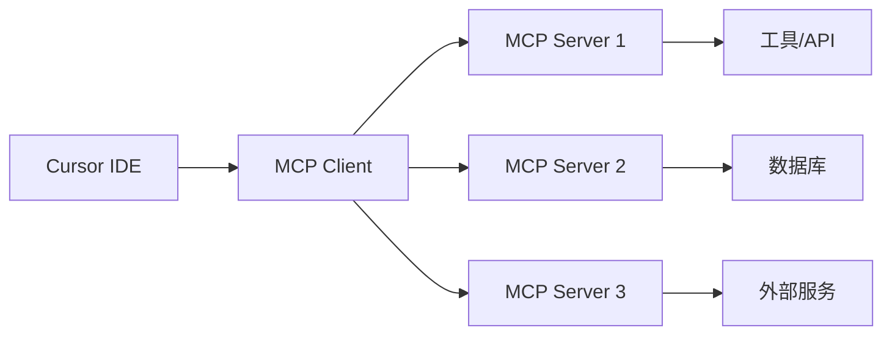

# 🎯 MCP (Model Context Protocol) 在 Cursor 中的完整配置指南

## 📋 什么是 MCP？

**MCP (Model Context Protocol)** 是一个开放标准，允许 AI 应用程序与各种工具和数据源进行标准化通信。在 Cursor IDE 中，MCP 充当插件框架，让您可以扩展内置 AI 助手的功能。

### 🎯 MCP 的核心概念



- **MCP Host/Client**: Cursor IDE（发起请求）
- **MCP Server**: 您的自定义服务（处理请求并与工具交互）
- **工具/资源**: 实际执行任务的组件

## 🚀 第一步：配置 Cursor MCP

### 1.1 打开 Cursor MCP 设置

1. 启动 Cursor IDE
2. 导航到：`Cursor Settings` → `Tools & Integrations` → `MCP Tools`
3. 点击 `+ New MCP Server` 或 `Add a Custom MCP Server`

### 1.2 MCP 配置文件位置

MCP 配置文件位于：`~/.cursor/mcp.json`

## 🔧 第二步：基础 MCP 服务器配置

### 2.1 简单测试服务器（基于 mcp_server）

```json
{
  "mcpServers": {
    "ai-video-master": {
      "command": "uv",
      "args": ["run", "python", "server_official.py"],
      "cwd": "/Users/sshlijy/Desktop/demo/mcp_server"
    }
  }
}
```


## 🎬 第三步：项目特定的 MCP 配置

### 3.1 完整的视频处理 MCP 配置

基于您的项目结构，这是一个完整的配置示例：

```json
{
  "mcpServers": {
    "ai-video-master": {
      "command": "uv",
      "args": ["run", "python", "server_official.py"],
      "cwd": "/Users/sshlijy/Desktop/demo/mcp_server",
      "env": {
        "GOOGLE_APPLICATION_CREDENTIALS": "./video_to_slice/config/your-service-account.json",
        "DASHSCOPE_API_KEY": "your_dashscope_api_key",
        "DEEPSEEK_API_KEY": "your_deepseek_api_key"
      }
    },

  }
}
```

### 3.2 Node.js 基础示例（参考网络资料）

```json
{
  "mcpServers": {
    "hello-world": {
      "command": "node",
      "args": ["/absolute/path/to/your/index.js"]
    }
  }
}
```

## 🛠️ 第四步：测试 MCP 连接

### 4.1 基础连接测试

1. 保存 `mcp.json` 配置文件
2. 重启 Cursor IDE
3. 在 Cursor 中打开 Agent 模式（`Ctrl + Shift + I`）
4. 测试命令：
   ```
   使用 reverse_text 工具反转 "Hello MCP"
   ```

### 4.2 视频处理功能测试

```
请使用 video_to_slice 工具对我的视频进行切片处理
```

## 🎯 第五步：高级配置和最佳实践

### 5.1 环境变量管理

创建 `.env` 文件管理敏感信息：
```bash
# .env 文件
GOOGLE_APPLICATION_CREDENTIALS=./config/service-account.json
DASHSCOPE_API_KEY=your_api_key_here
DEEPSEEK_API_KEY=your_api_key_here
```

### 5.2 多服务器配置策略

```json
{
  "mcpServers": {
    "video-processing": {
      "command": "uv",
      "args": ["run", "python", "server_official.py"],
      "cwd": "/path/to/mcp_server"
    },

    "simple-tools": {
      "command": "node",
      "args": ["/path/to/simple-mcp.js"]
    }
  }
}
```

## 🔍 第六步：故障排除

### 6.1 常见问题

1. **服务器启动失败**
   - 检查路径是否正确
   - 验证依赖是否安装
   - 查看 Cursor 输出面板的错误信息

2. **权限问题**
   ```bash
   chmod +x server.py
   ```

3. **Python 路径问题**
   ```json
   {
     "env": {
       "PYTHONPATH": "/your/project/root"
     }
   }
   ```

### 6.2 调试技巧

1. **查看 Cursor MCP 日志**
   - `View` → `Output` → `Cursor MCP`

2. **手动测试服务器**
   ```bash
   cd mcp_server
   uv run python server_official.py
   ```

3. **使用 MCP Inspector**
   ```bash
   npx @modelcontextprotocol/inspector
   ```

## 🎉 第七步：验证和使用

### 7.1 成功指标

- ✅ Cursor MCP 设置中显示服务器为 "Connected"
- ✅ 在 Agent 模式中可以调用工具
- ✅ 工具返回预期结果

### 7.2 实际使用场景

1. **视频处理工作流**
   ```
   帮我处理 video_1.mp4：
   1. 先进行智能切片
   2. 生成字幕文件  
   3. 分析产品介绍片段
   4. 添加智能标签
   ```

2. **数据反馈处理**
   ```
   执行数据回传处理，更新本地AI分析结果
   ```

## 📚 参考资源

- [MCP 官方文档](https://modelcontextprotocol.io/)
- [Cursor MCP 指南](https://docs.cursor.com/mcp)
- [MCP Server 示例库](https://github.com/modelcontextprotocol)

## 🎯 总结

MCP 让您能够：
- 🔧 扩展 Cursor AI 的功能
- 🎬 集成自定义工具和服务
- 🤖 创建专业化的 AI 工作流
- 📊 连接外部数据源和 API

通过正确配置 MCP，您的 Cursor IDE 将变成一个强大的AI驱动开发环境！ 