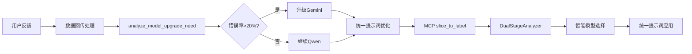
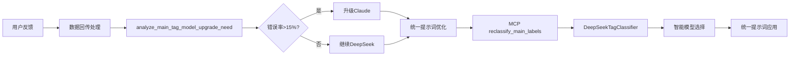

# 🎯 统一AI模型管理架构 - 完美对称设计

## 系统架构对比

现在两个AI分析系统采用了完全对称的架构设计：

### 📊 架构对称性总览

| 组件 | 切片标签分析 | 主标签分析 |
|------|-------------|------------|
| **主要模型** | Qwen VL Max Latest | DeepSeek Chat |
| **升级模型** | Gemini 2.5 Pro | Claude 4.0 Sonnet (OpenRouter) |
| **切换阈值** | 总错误率 > 20% | 主标签错误率 > 15% |
| **决策文件** | `model_upgrade_decision.json` | `main_tag_model_upgrade_decision.json` |
| **环境变量** | `USE_GEMINI_UPGRADE` | `USE_ENHANCED_MAIN_TAG` |
| **提示词管理** | `prompt_templates.py` | `main_tag_prompt_templates.py` |
| **API密钥** | `DASHSCOPE_API_KEY` + `GOOGLE_AI_API_KEY` | `DEEPSEEK_API_KEY` + `OPENROUTER_API_KEY` |

## 🔄 完全对称的工作流程

### 切片标签分析流程


### 主标签分析流程


## 🎯 核心设计原则

### 1. 成本优先策略
- **默认低成本模型**: 日常使用成本可控的主力模型
- **按需高精度升级**: 仅在质量不满足要求时升级
- **智能决策**: 基于实际反馈数据自动决策

### 2. 质量保证机制  
- **错误率监控**: 持续监控各类错误指标
- **阈值触发**: 超过预设阈值自动升级模型
- **提示词优化**: 持续优化提示词质量

### 3. 统一标准管理
- **相同提示词**: 同一任务的不同模型使用相同提示词
- **版本控制**: 完整的优化历史和版本管理
- **质量追踪**: 优化效果的详细记录

## 🔧 技术实现细节

### 模型切换实现

#### 切片标签分析器
```python
# slice_to_label/src/ai_analyzers.py
class DualStageAnalyzer:
    def __init__(self):
        # 检查模型升级决策
        upgrade_decision = self._check_upgrade_decision()
        if upgrade_decision.get("upgrade_decision", False):
            self.use_gemini = True  # 升级到Gemini
        else:
            self.use_gemini = False  # 使用Qwen
```

#### 主标签分析器
```python
# feishu_pool/deepseek_tag_classifier.py  
class DeepSeekTagClassifier:
    def __init__(self):
        # 检查模型升级决策
        upgrade_decision = self._check_model_upgrade_decision()
        if upgrade_decision.get("upgrade_decision", False):
            self.model_name = "claude-3-5-sonnet"  # 升级到Claude
        else:
            self.model_name = "deepseek-chat"  # 使用DeepSeek
```

### 提示词统一管理

#### 切片标签提示词
```python
# slice_to_label/config/prompt_templates.py
def get_unified_prompt(template_name: str, model_type: str = "universal") -> str:
    return prompt_manager.get_prompt(template_name, model_type)
```

#### 主标签提示词
```python
# feishu_pool/main_tag_prompt_templates.py
def get_main_tag_prompt(enhanced: bool = False) -> str:
    return prompt_manager.get_prompt(enhanced=enhanced)
```

### 决策文件格式

#### 切片标签决策文件
```json
{
  "upgrade_decision": true,
  "upgrade_time": "2024-XX-XX",
  "total_segments": 100,
  "error_segments": 25,
  "error_rate": 25.0,
  "upgrade_threshold": 20.0,
  "interaction_errors": 15,
  "emotion_errors": 10,
  "upgrade_reason": "error_rate_exceeded_threshold",
  "target_model": "gemini-2.5-pro"
}
```

#### 主标签决策文件
```json
{
  "upgrade_decision": true,
  "upgrade_time": "2024-XX-XX", 
  "total_segments": 100,
  "main_tag_errors": 18,
  "main_tag_error_rate": 18.0,
  "upgrade_threshold": 15.0,
  "classification_errors": 12,
  "confidence_errors": 6,
  "upgrade_reason": "main_tag_error_rate_exceeded_threshold",
  "target_model": "claude-3-5-sonnet"
}
```

## 🚀 完整数据流

### 统一数据回传处理
```bash
数据回传处理.sh
├── analyze_model_upgrade_need              # 切片标签模型决策
├── analyze_main_tag_model_upgrade_need     # 主标签模型决策
├── optimize_prompts_based_on_feedback      # 切片标签提示词优化
└── optimize_main_tag_prompts_based_on_feedback  # 主标签提示词优化
```

### MCP工具集成
```python
# mcp_server/server_official.py
# 切片标签分析
elif name == "slice_to_label":
    # 检查模型升级决策文件
    upgrade_decision_file = project_root / "slice_to_label" / "model_upgrade_decision.json"
    
# 主标签分析  
elif name == "reclassify_main_labels":
    # 检查主标签模型升级决策文件
    upgrade_decision_file = project_root / "feishu_pool" / "main_tag_model_upgrade_decision.json"
```

## 📊 优势总结

### ✅ 完美对称的架构
1. **相同设计逻辑**: 两个系统采用完全相同的设计思路
2. **一致的决策机制**: 基于错误率的智能升级决策
3. **统一的管理接口**: 提示词管理和模型切换接口统一
4. **对称的工作流程**: 从反馈分析到模型应用的完整对称

### 🔧 技术优势
1. **成本控制**: 默认低成本，按需升级高精度
2. **质量保证**: 错误驱动的持续优化机制
3. **可维护性**: 统一的架构便于维护和扩展
4. **可追踪性**: 完整的决策和优化历史记录

### 🎯 业务价值
1. **准确性提升**: 智能模型选择确保分析质量
2. **成本优化**: 按需升级降低整体使用成本
3. **持续改进**: 基于反馈的提示词优化机制
4. **系统稳定**: 多重兜底保证系统稳定运行

---

## 🎉 架构对称性确认

现在两个AI分析系统已经实现了完美的架构对称：

### 切片标签分析: Qwen ↔ Gemini  
### 主标签分析: DeepSeek ↔ Claude

两个系统都采用：
- 🤖 **相同的智能切换逻辑**
- 🎯 **统一的提示词管理**  
- 📊 **一致的决策机制**
- 🔄 **对称的工作流程**

这种设计确保了系统的一致性、可维护性和扩展性，同时在成本控制和质量保证之间达到了最佳平衡。 