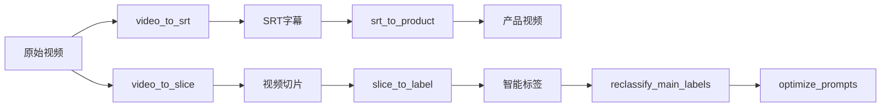

# 🎬 AI Video Master MCP Server

> **统一AI视频分析工具集** - 基于Model Context Protocol (MCP)的智能视频处理服务器，为Cursor提供7大AI工具集成

AI Video Master MCP Server 是一个基于 [Model Context Protocol (MCP)](https://github.com/modelcontextprotocol/python-sdk) 的视频处理工具链统一接口。它将多个独立的视频处理模块封装成一个统一的MCP服务，为AI助手提供强大的视频处理能力。

## 📋 功能概览

### 🎯 核心工具 (7个)

| 工具名称 | 功能描述 | 输入 | 输出 |
|---------|----------|------|------|
| `reverse_text` | 文本反转测试 | 文本字符串 | 反转后文本 |
| `video_to_slice` | 视频智能切片 | 视频文件 | 场景切片 + 元数据 |
| `video_to_srt` | 视频转字幕 | 视频文件 | SRT字幕文件 |
| `srt_to_product` | 生成产品视频 | SRT + 原视频 | 产品介绍视频切片 |
| `slice_to_label` | 片段标签分析 | 视频切片 | 智能标签 + 分析报告 |
| `reclassify_main_labels` | 主标签重分类 | 飞书数据 | 优化后的主标签 |
| `optimize_prompts` | 智能提示词优化 | 反馈数据 | 优化后的提示词 |

### 🔗 完整工作流程



## 🚀 快速开始

### 第一步：运行安装脚本

```bash
# 给安装脚本执行权限
chmod +x setup_mcp.sh

# 运行安装脚本
./setup_mcp.sh
```

安装脚本会自动：
- ✅ 检查Python环境 (需要3.10+)
- ✅ 安装UV包管理器
- ✅ 创建MCP服务器虚拟环境
- ✅ 安装MCP依赖
- ✅ 检查各模块状态
- ✅ 创建配置文件和启动脚本

### 第二步：配置API密钥

```bash
# 复制环境配置模板
cp .env.example .env

# 编辑配置文件，填入你的API密钥
nano .env  # 或使用你喜欢的编辑器
```

#### 必需的API密钥配置：

```bash
# Google Cloud Video Intelligence API (video_to_slice)
GOOGLE_APPLICATION_CREDENTIALS=./video_to_slice/config/your-service-account.json

# DashScope API (video_to_srt)
DASHSCOPE_API_KEY=your_dashscope_api_key

# DeepSeek API (srt_to_product)
DEEPSEEK_API_KEY=your_deepseek_api_key
```

### 第三步：测试MCP服务器

```bash
# 测试服务器功能
./test_mcp_server.py
```

### 第四步：启动MCP服务器

```bash
# 启动服务器
./start_mcp_server.sh
```

## 🔧 详细配置

### API密钥获取指南

#### 1. Google Cloud Video Intelligence API

1. 访问 [Google Cloud Console](https://console.cloud.google.com/)
2. 创建项目或选择现有项目
3. 启用 Video Intelligence API
4. 创建服务账户密钥（JSON格式）
5. 将JSON文件放到 `video_to_slice/config/` 目录下
6. 在 `.env` 文件中设置路径

#### 2. DashScope API (阿里云)

1. 访问 [DashScope控制台](https://dashscope.console.aliyun.com/)
2. 注册并创建API密钥
3. 在 `.env` 文件中设置 `DASHSCOPE_API_KEY`

#### 3. DeepSeek API

1. 访问 [DeepSeek平台](https://platform.deepseek.com/)
2. 注册并创建API密钥
3. 在 `.env` 文件中设置 `DEEPSEEK_API_KEY`

### 环境变量说明

```bash
# =========================
# Google Cloud 配置
# =========================
GOOGLE_APPLICATION_CREDENTIALS=./video_to_slice/config/your-service-account.json

# =========================
# DashScope 配置
# =========================
DASHSCOPE_API_KEY=your_dashscope_api_key
DEFAULT_VOCAB_ID=vocab-baby33c2-ab5cb40922434e2aa796863c5140f9f1  # 婴幼儿奶粉专用词汇表
DEFAULT_LANGUAGE=zh
DEFAULT_QUALITY=auto

# =========================
# DeepSeek 配置
# =========================
DEEPSEEK_API_KEY=your_deepseek_api_key
DEEPSEEK_MODEL=deepseek-chat
DEEPSEEK_TEMPERATURE=0.3
MIN_SEGMENT_DURATION=30
MAX_SEGMENT_DURATION=120

# =========================
# 日志配置
# =========================
LOG_LEVEL=INFO
```

## 🛠️ MCP工具详细说明

### 1. video_to_slice - 视频智能切片

**功能：** 基于Google Cloud Video Intelligence API进行视频场景检测和智能切片

**参数：**
```json
{
  "input_dir": "string (必需)",           // 输入视频目录路径
  "output_dir": "string",                 // 输出切片目录路径
  "concurrent": 3,                        // 视频级并发数 (1-3)
  "ffmpeg_workers": 4                     // FFmpeg并行线程数 (2-8)
}
```

**输出：**
- 视频切片文件 (.mp4)
- 切片元数据 (.json)
- 批处理报告

### 2. video_to_srt - 视频转字幕

**功能：** 使用DashScope语音识别API将视频转换为SRT字幕

**参数：**
```json
{
  "input_dir": "string (必需)",           // 输入视频目录路径
  "output_dir": "string"                  // 输出SRT目录路径
}
```

**特性：**
- 🍼 内置婴幼儿奶粉专业词汇表
- 📝 高精度中文语音识别
- 🔍 智能质量控制

**输出：**
- SRT字幕文件 (.srt)
- 转录质量报告

### 3. srt_to_product - 生成产品视频

**功能：** 基于SRT字幕内容，使用DeepSeek AI分析生成产品介绍视频切片

**参数：**
```json
{
  "srt_dir": "string (必需)",             // SRT字幕文件目录路径
  "output_dir": "string",                 // 输出产品视频目录路径  
  "input_video_dir": "string"             // 原始视频目录路径
}
```

**AI分析能力：**
- 🤖 智能识别产品介绍片段
- 🎯 专业婴幼儿奶粉领域优化
- ⏱️  自动优化切片时长

**输出：**
- 产品介绍视频切片 (`${原文件名}_product.mp4`)
- AI分析报告

### 4. slice_to_label - 片段标签分析

**功能：** 为视频片段提取智能标签，使用双层AI识别机制

**参数：**
```json
{
  "input_dir": "string (必需)",           // 输入视频片段目录路径
  "analysis_type": "dual|enhanced"        // 分析类型：dual(双层视觉) 或 enhanced(双层+音频)
}
```

**双层识别机制：**
- 🎯 第一层：AI-B通用识别（物体/场景/情绪）
- 🏷️  第二层：AI-A品牌检测（条件触发）
- 🎵 音频增强：语音转录语义分析

**输出：**
- 标签分析结果 (.json)
- 批量分析统计报告

## 🔌 MCP客户端集成

### Claude Desktop 配置

1. 打开Claude Desktop配置文件：
   - macOS: `~/Library/Application Support/Claude/claude_desktop_config.json`
   - Windows: `%APPDATA%\Claude\claude_desktop_config.json`

2. 添加MCP服务器配置：
```json
{
  "mcpServers": {
    "ai-video-master": {
      "command": "/Users/sshlijy/.local/bin/uv",
      "args": [
        "--directory",
        "/Users/sshlijy/Desktop/demo/mcp_server",
        "run",
        "mcp_server.py"
      ]
    }
  }
}
```

3. 重启Claude Desktop

### Cursor 配置

使用项目根目录的 `mcp_config.json`：

```json
{
  "mcpServers": {
    "ai-video-master": {
      "command": "python",
      "args": ["./mcp_server.py"],
      "env": {
        "PATH": "./.venv/bin:$PATH"
      }
    }
  }
}
```

## 📊 使用示例

### 示例1：完整视频处理流程

```python
# 1. 视频切片
await call_tool("video_to_slice", {
    "input_dir": "./videos/input",
    "output_dir": "./videos/slices"
})

# 2. 生成字幕
await call_tool("video_to_srt", {
    "input_dir": "./videos/input",
    "output_dir": "./videos/srt"
})

# 3. 生成产品视频
await call_tool("srt_to_product", {
    "srt_dir": "./videos/srt",
    "input_video_dir": "./videos/input",
    "output_dir": "./videos/products"
})

# 4. 标签分析
await call_tool("slice_to_label", {
    "input_dir": "./videos/slices",
    "analysis_type": "enhanced"
})
```

### 示例2：单独使用某个工具

```python
# 只进行视频切片
result = await call_tool("video_to_slice", {
    "input_dir": "/path/to/videos",
    "concurrent": 2,
    "ffmpeg_workers": 6
})
```

## 🐛 故障排除

### 常见问题

#### 1. Python版本问题
```bash
# 错误：需要Python 3.10+
# 解决：安装正确的Python版本
pyenv install 3.10
pyenv local 3.10
```

#### 2. API密钥问题
```bash
# 错误：API密钥未设置
# 解决：检查.env文件配置
cat .env
# 确保所有必需的API密钥都已设置
```

#### 3. 模块导入错误
```bash
# 错误：无法导入模块
# 解决：检查各模块环境
cd video_to_slice && source .venv/bin/activate
cd ../video_to_srt && source .venv/bin/activate
# 确保各模块环境已正确设置
```

#### 4. Google Cloud凭据问题
```bash
# 错误：GOOGLE_APPLICATION_CREDENTIALS
# 解决：检查JSON文件路径
ls -la video_to_slice/config/
# 确保服务账户JSON文件存在且路径正确
```

### 日志调试

启用详细日志：
```bash
export LOG_LEVEL=DEBUG
./start_mcp_server.sh
```

## 📈 性能优化

### 并发配置建议

- **video_to_slice**: 并发数不超过3（受Google API配额限制）
- **ffmpeg_workers**: 建议设置为CPU核心数的一半
- **内存使用**: 每个视频处理大约需要500MB-1GB内存

### API配额管理

- **Google Cloud**: 默认每分钟1000次请求
- **DashScope**: 根据套餐不同有不同限制
- **DeepSeek**: 建议合理控制请求频率

## 🛡️ 安全说明

- API密钥存储在本地`.env`文件中，不会上传到云端
- 所有处理都在本地进行，保护数据隐私
- 建议定期轮换API密钥

## 📚 更多资源

- [MCP官方文档](https://github.com/modelcontextprotocol/python-sdk)
- [Google Cloud Video Intelligence API](https://cloud.google.com/video-intelligence)
- [DashScope文档](https://help.aliyun.com/zh/dashscope)
- [DeepSeek API文档](https://platform.deepseek.com/api-docs)

## 🤝 贡献

欢迎提交Issue和Pull Request来改进此项目！

## 📄 许可证

MIT License - 详见 LICENSE 文件 