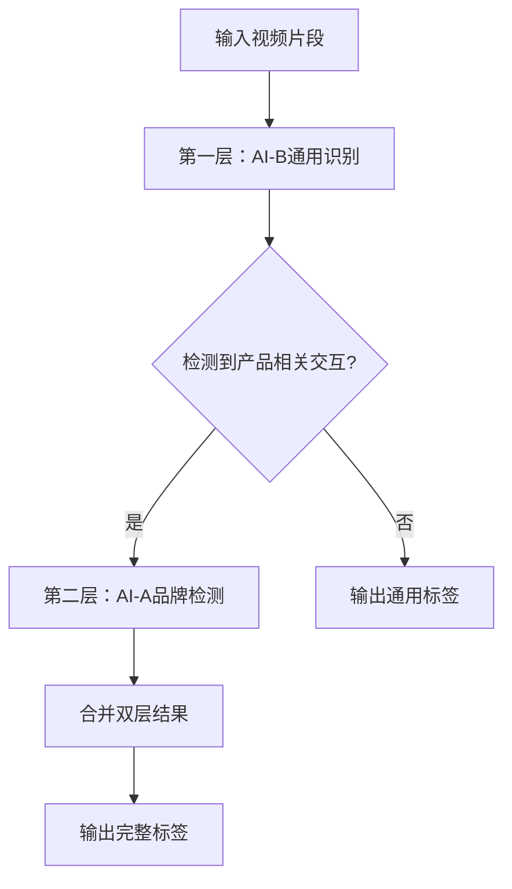

# 🎯 双层识别机制详细指南

## 概述

**双层识别机制** 是 `slice_to_label` 项目的核心技术架构，专门为母婴行业视频内容分析设计。该机制通过**视觉优先**的策略，实现精准的标签提取和品牌识别。

## 🏗️ 架构设计

### 📊 第一层：AI-B 通用识别
> **任务**: 基础元素识别 + 主谓宾动作识别

#### 🎯 识别重点
1. **主谓宾交互识别（核心）**
   - 格式：`主语 + 动词 + 宾语`
   - 示例：
     - ✅ `"宝宝开心喝奶"`
     - ✅ `"妈妈冲泡奶粉"`
     - ✅ `"医生推荐产品"`
     - ✅ `"宝宝拒绝奶瓶"`
     - ❌ `"宝宝, 奶瓶"` (孤立词汇)

2. **场景环境识别**
   - 家庭环境：家中卧室、客厅、厨房、婴儿房
   - 医疗环境：医院、诊所
   - 其他环境：户外、公园、商店

3. **情绪状态识别**
   - 积极情绪：开心、温馨、平静、满意
   - 消极情绪：焦虑、担心

#### 🚫 第一层限制
- **严格禁止品牌识别**
- 专注行为交互，不涉及商业元素
- 输出客观描述，避免主观判断

### 🔍 第二层：AI-A 品牌检测
> **任务**: 条件触发的品牌专用检测

#### ⚡ 触发条件
只有当第一层检测到以下关键词时才启动：
- **产品相关**: 罐、产品、奶粉罐、奶瓶、奶粉、配方奶
- **行为相关**: 喂养、喝、冲泡、搅拌
- **包装相关**: 奶粉包装、包装盒、成分表

#### 🏢 核心品牌列表
```python
CORE_BRANDS = [
    '启赋', 'illuma', '惠氏', 'Wyeth', 
    '蕴淳', 'A2', 'ATWO', 'HMO'
]
```

#### 🎯 检测重点
1. **包装品牌Logo**
2. **产品包装正面品牌名称**
3. **清晰可见的品牌标识**

#### 🚫 第二层限制
- **严格限制在核心品牌列表内**
- 模糊或不确定时输出 "无"
- 忽略非核心品牌

## 🔄 工作流程



### 详细步骤

1. **🎬 视频输入**
   - 接收5-15秒视频片段
   - 质量检查（格式、大小、时长）

2. **🎯 第一层处理**
   ```
   输入: segment_001.mp4
   处理: AI-B通用识别
   输出: {
     "interaction": "宝宝开心喝奶",
     "scene": "家中客厅",
     "emotion": "开心"
   }
   ```

3. **🔍 触发判断**
   ```python
   keywords = extract_keywords("宝宝开心喝奶")
   if any(keyword in TRIGGER_KEYWORDS for keyword in keywords):
       # 触发第二层
       trigger_brand_detection = True
   ```

4. **🏢 第二层处理**
   ```
   输入: segment_001.mp4 + 第一层结果
   处理: AI-A品牌专用检测
   输出: {
     "brand_elements": "启赋"
   }
   ```

5. **🎯 结果合并**
   ```json
   {
     "object": "宝宝开心喝奶",
     "scene": "家中客厅", 
     "emotion": "开心",
     "brand_elements": "启赋",
     "confidence": 0.85,
     "analysis_method": "dual_stage_visual"
   }
   ```

## 💡 设计优势

### 🎯 精确性
- **分层处理**避免品牌识别干扰基础分析
- **条件触发**减少误识别率
- **专用检测**提高品牌识别准确性

### ⚡ 效率性
- **视觉优先**，无需音频处理的额外开销
- **条件触发**，只在必要时进行品牌检测
- **缓存机制**，避免重复分析

### 🔒 可控性
- **严格的品牌列表**控制
- **明确的触发条件**
- **可追溯的分析过程**

## 📊 两种分析模式

### 🎯 `dual` - 双层机制（推荐）
```bash
uv run python batch_slice_to_label.py --input data/input --type dual
```

**特点:**
- 纯视觉分析
- 双层识别机制
- 快速高效
- 适合批量处理

**输出示例:**
```json
{
  "analysis_method": "dual_stage_visual",
  "object": "妈妈冲泡奶粉",
  "scene": "家中厨房",
  "emotion": "温馨",
  "brand_elements": "启赋",
  "confidence": 0.78
}
```

### 🔊 `enhanced` - 增强分析
```bash
uv run python batch_slice_to_label.py --input data/input --type enhanced
```

**特点:**
- 双层视觉 + 音频增强
- 更丰富的语义信息
- 处理时间较长
- 适合高质量分析

**输出示例:**
```json
{
  "analysis_method": "enhanced_dual_stage",
  "object": "妈妈冲泡奶粉, 产品介绍",
  "scene": "家中厨房",
  "emotion": "满意",
  "brand_elements": "启赋",
  "confidence": 0.89,
  "transcription": "这个启赋奶粉冲出来真的很好...",
  "audio_analysis_details": {
    "product_mentions": ["奶粉冲泡", "A2奶源"],
    "brand_mentions": ["启赋"],
    "emotion_expression": ["满意"]
  }
}
```

## 🎪 实际应用场景

### 场景1：产品介绍视频
```
输入: 妈妈展示奶粉罐的视频片段
第一层: "妈妈展示产品" + "家中厨房" + "满意"
触发: 检测到"产品"关键词
第二层: 识别奶粉罐上的"启赋"品牌
输出: 完整的产品展示标签
```

### 场景2：喂养场景
```
输入: 宝宝喝奶的视频片段  
第一层: "宝宝开心喝奶" + "家中客厅" + "开心"
触发: 检测到"喝奶"关键词
第二层: 检查画面中的奶瓶品牌
输出: 喂养行为 + 品牌信息
```

### 场景3：日常生活
```
输入: 宝宝玩耍的视频片段
第一层: "宝宝玩耍" + "家中客厅" + "开心"  
触发: 未检测到产品相关关键词
第二层: 不触发
输出: 仅生活场景标签
```

## 🛠️ 配置和调优

### 调整触发阈值
```python
# config/slice_config.py
BRAND_TRIGGER_KEYWORDS = [
    '罐', '产品', '喂养', '喝', '冲泡', '搅拌',
    '奶粉罐', '奶瓶', '奶粉', '配方奶', '婴儿奶粉'
]
```

### 修改品牌列表
```python  
# config/slice_config.py
CORE_BRANDS = [
    '启赋', 'illuma', '惠氏', 'Wyeth', 
    '蕴淳', 'A2', 'ATWO', 'HMO'
]
```

### 质量控制参数
```python
QUALITY_CONTROL = {
    "min_confidence": 0.3,      # 最低置信度
    "quality_threshold": 0.5,   # 质量阈值
    "min_file_size_mb": 0.1,    # 最小文件大小
    "max_file_size_mb": 500     # 最大文件大小
}
```

## 🎉 总结

双层识别机制通过 **视觉优先 + 条件触发** 的设计理念，实现了：

- ✅ **高精度**的行为识别  
- ✅ **准确的**品牌检测
- ✅ **高效的**批量处理
- ✅ **可控的**分析流程

这种机制特别适合母婴行业的视频内容分析，能够在保证分析质量的同时，提供快速稳定的处理能力。 